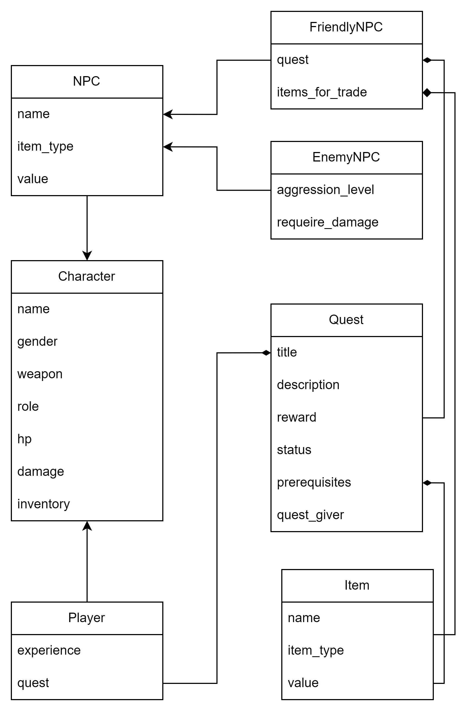
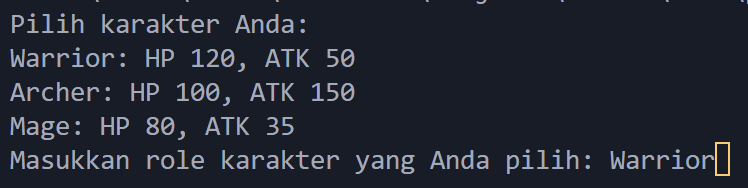
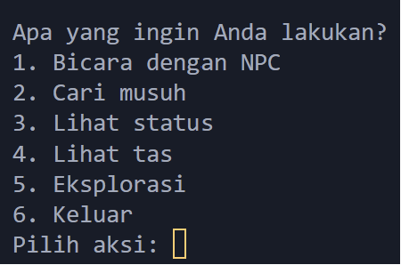
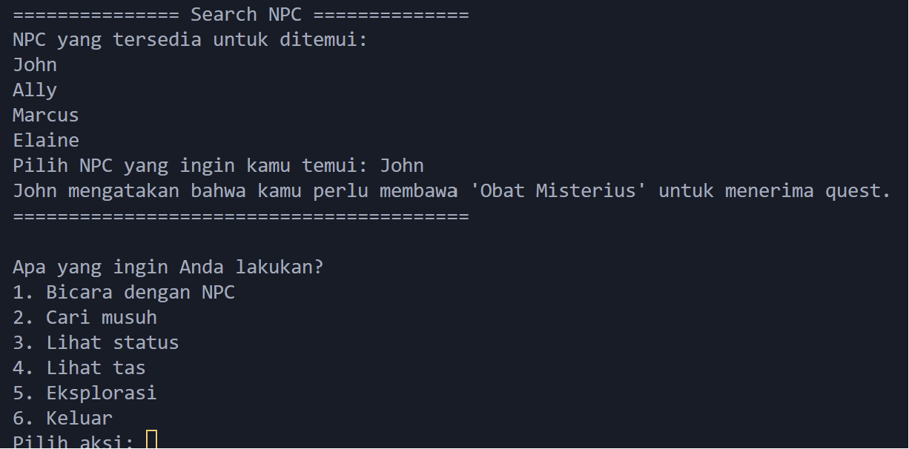
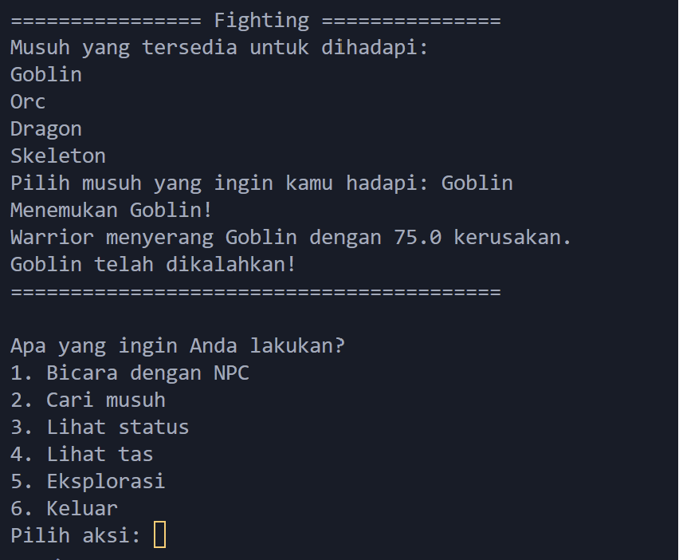
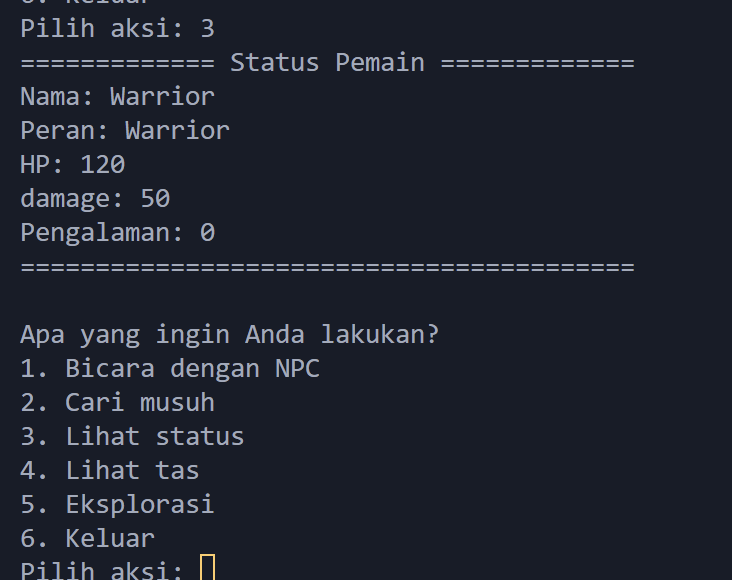
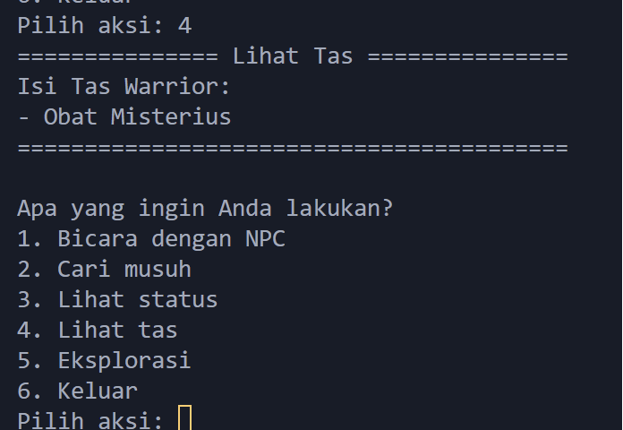
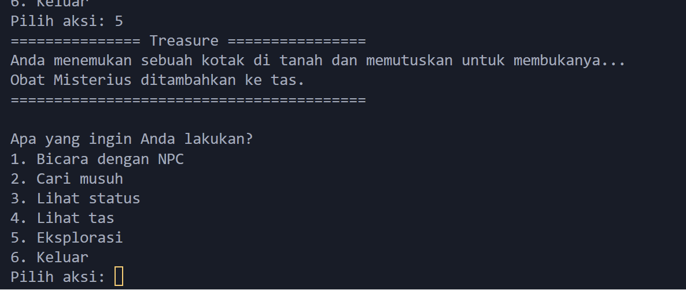

# TP1DPBO2024C1

TP1DPBO2024 - Simulasi Game

Saya Muhamad Sabil Fausta NIM 2210142 mengerjakan Tugas Praktikum 1 dalam mata kuliah Desain dan Pemrograman Berorientasi Objek untuk keberkahanNya maka saya tidak melakukan kecurangan seperti yang telah dispesifikasikan. Aamiin.

## Desain Program

Dalam program game sederhana ini, pemain diawali dengan proses pemilihan karakter di mana mereka dapat memilih antara beberapa role karakter yang tersedia, seperti Warrior, Archer, atau Mage. Setiap karakter ini memiliki atribut dasar yang berbeda, termasuk poin kesehatan (HP) dan kekuatan serangan (ATK), yang didefinisikan dalam kelas Character. Kelas Player, yang merupakan turunan dari Character, menambahkan lebih banyak fungsionalitas khusus pemain, seperti pengalaman (experience) dan sistem quest yang memungkinkan pemain menerima dan menyelesaikan quest untuk mendapatkan hadiah. Sistem inventaris yang diimplementasikan melalui metode add_item_to_inventory dan show_inventory memungkinkan pemain untuk mengumpulkan dan menggunakan item yang ditemukan selama perjalanan mereka.

Setelah pemain memilih karakter, mereka dapat menjelajahi dunia game yang diisi dengan NPC yang berinteraksi dengan mereka melalui sistem dialog dan tindakan. FriendlyNPC menawarkan quest dan dapat berdagang item dengan pemain, memperkaya pengalaman pemain dengan memberikan mereka tujuan dan hadiah. Contohnya, untuk menerima quest tertentu, pemain mungkin perlu memiliki 'Obat Misterius' dalam inventaris mereka, yang dapat diperoleh melalui eksplorasi atau interaksi dengan NPC lain. Di sisi lain, EnemyNPC menantang pemain dengan pertarungan, di mana sistem pertarungan menguji kekuatan karakter pemain melalui interaksi yang didefinisikan dalam metode attack. Kekuatan, strategi, dan item yang dikumpulkan pemain akan mempengaruhi hasil dari pertarungan ini, mendorong pemain untuk merencanakan langkah mereka dengan cermat dan memanfaatkan sumber daya yang mereka kumpulkan untuk mengatasi tantangan yang dihadapi.

## Alur Program

1. Pertama pilih terlebih dahulu role yang akan dipakai :

   

2. Pilih aksi yang akan dilakukan :

3. Bicara dengan NPC

4. Berantem

5. Lihat Status

6. Lihat Inventory
   

7. Eksplorasi

8. Karena udah dapet item misterius bisa bicara dengan NPC
